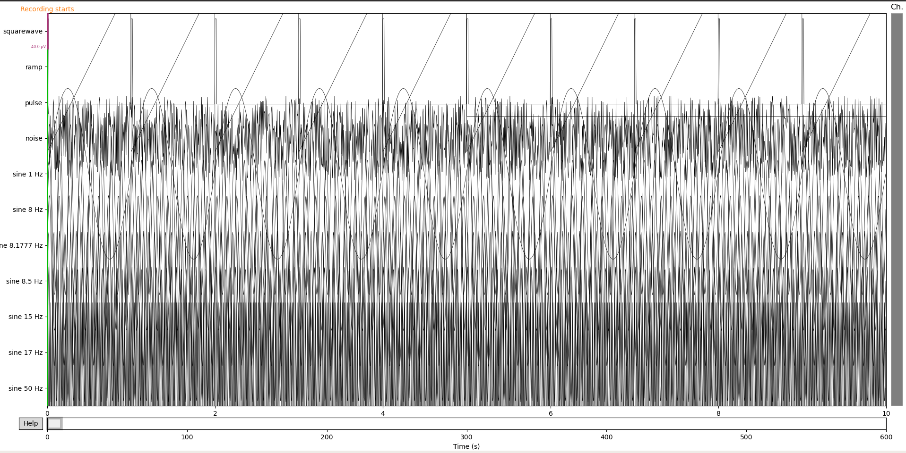
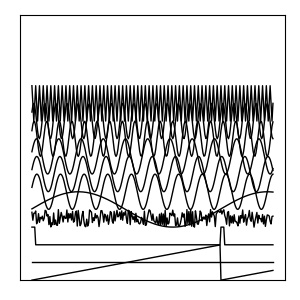

# EDFファイルの可視化について
## Overview
このドキュメントはmneモジュールを用いたEDFファイルの可視化を行う方法について紹介するものです。  

## Requirement
本ドキュメントでは次のバージョンのPython、モジュールを使用します。
```
Python 3.8.3
matplotlib 3.2.2
numpy 1.18.5
mne 0.20.0
```
プログラムを理解するにあたり、Pythonの最低限の知識(for文、`list`や`tuple`の操作)が必要になります。  

## 本文  
このドキュメントではそれぞれの公式リファレンスの必要な部分のみ使っています。文中で紹介した各関数にはリンクが埋め込まれています。option等の詳しい部分については公式リファレンスを参照して下さい。

### Step1 環境構築
`linux(Ubuntu20.04 LTS)`での環境構築について紹介します。既に用意されている場合、`conda`等の環境を使っている場合は適宜読み飛ばし・読み替えを行って下さい。  
```bash
$sudo apt install python3
$sudo apt install python3-pip
$pip3 install matplotlib==3.2.2
$pip3 install numpy==1.18.5
$pip3 install mne==0.20
```

### Step2 EDFファイルのロード  
EDFファイルをロードします。適当な場所にEDFファイルを配置してください。手元に扱えるEDFファイルがない場合は、サンプルのデータを[github](https://github.com/holgern/pyedflib/tree/master/pyedflib/tests/data)等からダウンロードできます。mneモジュールでは[mne.io.read_raw_edf](https://mne.tools/stable/generated/mne.io.read_raw_edf.html#mne.io.read_raw_edf)でEDFファイルのロードを行うことができます。  
input:

```Python
import matplotlib.pyplot as plt
import mne
import numpy as np
EDF_NAME = 'edf_name.edf'
data=mne.io.read_raw_edf(EDF_NAME)
print(type(data))
print(data)
```
output:
```bash
<class 'mne.io.edf.edf.RawEDF'>
<RawEDF | test_generator.edf, 11 x 120000 (600.0 s), ~26 kB, data not loaded>
```

### Step3 infoの取得
EDFファイルが持つ基本的な情報を取得します。  
input:
```Python
import matplotlib.pyplot as plt
import mne
import numpy as np
EDF_NAME = 'edf_name.edf'
data=mne.io.read_raw_edf(EDF_NAME)
print(type(data.info))
print(data.info)
```
output:
```
<class 'mne.io.meas_info.Info'>
<Info | 7 non-empty values
 bads: []
 ch_names: squarewave, ramp, pulse, noise, sine 1 Hz, sine 8 Hz, sine ...
 chs: 11 EEG
 custom_ref_applied: False
 highpass: 0.0 Hz
 lowpass: 100.0 Hz
 meas_date: 2011-04-04 12:57:02 UTC
 nchan: 11
 projs: []
 sfreq: 200.0 Hz
>
```
`info`の特定の情報を参照したいときは、`dict`ライクに表記できます。  
input:  
```Python
import matplotlib.pyplot as plt
import mne
import numpy as np
EDF_NAME = 'edf_name.edf'
data=mne.io.read_raw_edf(EDF_NAME)
print(data.info['sfreq'])
```
output:  
```
200.0
```

### Step4 EEGの表示  
mneモジュールには、GUIで操作できるグラフを描画する機能があります。生成したインスタンスの[plot](https://mne.tools/dev/generated/mne.io.Raw.html#mne.io.Raw.plot)メソッドを単に呼び出すだけです(option等は公式リファレンスを参照して下さい)。下の図のようなグラフが描画されます。この図は時間軸や表示するチャンネル等をGUIで操作できます。教師データ等のデータを作るときには向きませんが、データの中身をとりあえず確認したい、というような状況には非常に有効です。  
input:
```python
import matplotlib.pyplot as plt
import mne
import numpy as np
EDF_NAME = 'edf_name.edf'
data=mne.io.read_raw_edf(EDF_NAME)
data.plot()
plt.show()
```
output:

### Step5 波形のロード
波形の`ndarray`は[get_data](https://mne.tools/dev/generated/mne.io.Raw.html#mne.io.Raw.get_data)で取得することができます。波形の`ndarray`は(チャンネル数,サンプリング数)の形になっています。特定の列のみ抽出したいとき、例えば0~1(s)の波形のみ抽出したい場合、`data_eeg[:,:int(data.info['sfreq'])].shape` のように`ndarray`のスライスを使って表現することができます。`get_data`メソッドのoptionで開始/終了時刻を指定することができますが、一括でデータを確保して、必要なもののみスライスで取り出していくほうが(多分)高速です。  
input:
```Python
import matplotlib.pyplot as plt
import mne
import numpy as np
EDF_NAME = 'edf_name.edf'
data=mne.io.read_raw_edf(EDF_NAME)
data_eeg=data.get_data()
print(type(data_eeg))
print(data_eeg.shape)
print(data_eeg)
```
output:
```
<class 'numpy.ndarray'>
(11, 120000)
[[ 9.99923705e-05  9.99923705e-05  9.99923705e-05 ... -9.99618524e-05
  -9.99618524e-05 -9.99618524e-05]
 [-9.99618524e-05 -9.89547570e-05 -9.79781796e-05 ...  9.70016022e-05
   9.80086976e-05  9.89852750e-05]
 [ 9.99923705e-05  9.99923705e-05  9.99923705e-05 ...  1.52590219e-08
   1.52590219e-08  1.52590219e-08]
 ...
 [ 4.53955901e-05  8.08880751e-05  9.87716487e-05 ... -8.08575570e-05
  -4.53650721e-05  1.52590219e-08]
 [ 5.09193561e-05  8.76325628e-05  9.99618524e-05 ... -8.76020447e-05
  -5.08888380e-05  1.52590219e-08]
 [ 9.99923705e-05  1.52590219e-08 -9.99618524e-05 ...  1.52590219e-08
  -9.99618524e-05  1.52590219e-08]]
```

### Step6 教師データ化
Step5でロードした脳波信号を機械学習で与えることができるフォーマットに変換していきます。ラベル付をするにあたり、脳波信号を適当なウィンドウで区切り、区切ったそれぞれのデータにラベル付けを行います。ラベル付けは、データセットによって参照する方法が異なると思うので、それぞれのフォーマットに従って下さい。ウィンドウで区切ったデータは`matplotlib.pyplot`内の[plot()](https://matplotlib.org/3.3.1/api/_as_gen/matplotlib.pyplot.plot.html)メソッドを用いることでグラフとして描画することができます。CNNに渡すための教師データとして画像を渡す場合と画像の画素値の配列を渡す場合の2パターンについて紹介します。  
#### (1) 画像を保存  
画像を保存する場合は単に`matplotlib.pyplot`内の[savefig](https://matplotlib.org/3.1.1/api/_as_gen/matplotlib.pyplot.savefig.html)メソッドを用います。for文を回してウィンドウを区切り、その都度画像化していきます。  
input:  
```Python
import matplotlib.pyplot as plt
import mne
import numpy as np
data=mne.io.read_raw_edf('edf_name.edf')
data_eeg=data.get_data()
freq=data.info['sfreq']
for j in range(int(data_eeg.shape[1]/freq)):
    data_window=data_eeg[:,j*freq:(j+1)*freq]
    plt.clf()
    fig=plt.figure(dpi=100,figsize=(3,3),tight_layout=True)
    plt.gca().xaxis.set_visible(False)
    plt.gca().yaxis.set_visible(False)
    plt.tick_params(labelbottom=False,
               labelleft=False,
               labelright=False,
               labeltop=False)
    for i,k in enumerate(data_window):
        plt.plot(k+0.00010*i,color='black',linewidth=1)
    plt.ylim(-0.001,0.0015)
    plt.savefig('../img/'+os.path.splitext(os.path.basename(EDF_NAME))[0]+'/'+os.path.splitext(os.path.basename(EDF_NAME))[0]+'-'+str(j)+'.jpg')
print(data_eeg.sum(axis=1))
```
output:  
下のような画像が`../img/ (file name) / (file name)-(枚目).jpg`に測定時間分の枚数生成されます。(`../img/ (file name)`のディレクトリは予め作成しておいて下さい。)  


#### (2) 画素の配列を保存  
画像の画素値を`numpy`配列として保存する場合は、matplotlibの[canvas.renderer.buffer_rgba](https://matplotlib.org/3.2.2/gallery/misc/agg_buffer_to_array.html)を用いて画素を配列として保存します。`im`として返される`ndarray`は`(300,300,4)`の形です。4番目の要素は透明度を表すので、1~3番目のみスライスして抽出しています。

input:

```python
import numpy as np
import mne
from PIL import Image
from matplotlib import pyplot as plt

data=mne.io.read_raw_edf('edf_name.edf')
data_eeg=data.get_data()
freq=int(data.info['sfreq'])
data_window=data_eeg[:,0*freq:1*freq]
fig=plt.figure(dpi=100,figsize=(3,3),tight_layout=True)
plt.gca().xaxis.set_visible(False)
plt.gca().yaxis.set_visible(False)
plt.tick_params(labelbottom=False,
               labelleft=False,
               labelright=False,
               labeltop=False)
for i,k in enumerate(data_window):
    plt.plot(k+0.00010*i,color='black',linewidth=1)
    plt.ylim(0,0.0015)
fig.canvas.draw()
im = np.array(fig.canvas.renderer.buffer_rgba())
#imのshapeは(300,300,4)
#4番目の要素は透明度のためスライス
rgb_arr = im[:,:,:3]
#rgb_arrのshapeは(300,300,3)

#テストとしてrgb_arrから画像を表示してみる
made_img = Image.fromarray(rgb_arr)
made_img.show()
```

output:

次のような画像が表示されます。正しく画素の値が`ndarray`に変換できているのがわかるかと思います。


